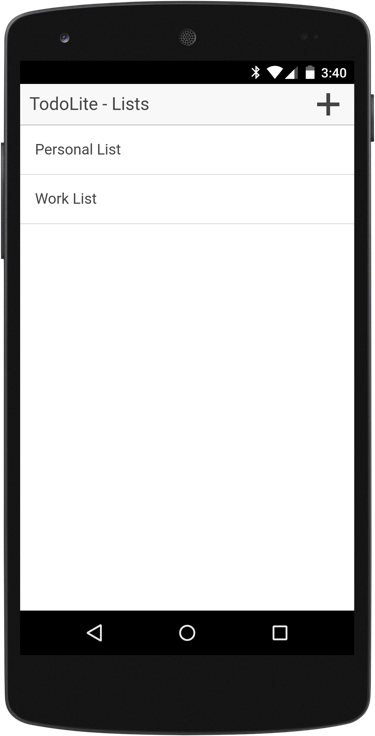
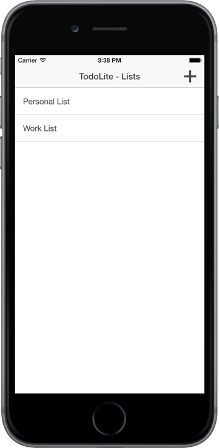

# Couchbase TodoLite for Ionic Framework

 

## Requirements

* Apache Cordova 5.0+
* Couchbase Lite PhoneGap SDK
* Apache Cordova Whitelist Plugin
* Apache Cordova Camera Plugin

## Configuration

### Installing Dependencies

After cloning the repository, run the following from your Terminal (Mac / Linux) or Command Prompt (Windows), with the project as your current working directory, to add the development platforms:

```
ionic platform add android
ionic platform add ios
```

Then install all the required plugins:

```
cordova plugin add cordova-plugin-whitelist
cordova plugin add cordova-plugin-device
cordova plugin add cordova-plugin-console
cordova plugin add cordova-plugin-splashscreen
cordova plugin add com.ionic.keyboard
cordova plugin add https://github.com/couchbaselabs/Couchbase-Lite-PhoneGap-Plugin.git
```

### Resolving Gradle Conflicts For Android

At compile time, you may run into the following error message:

```
Error: duplicate files during packaging of APK
```

To resolve this, you must extend the Gradle build file for Android as outlined in the official [Apache Cordova documentation](https://cordova.apache.org/docs/en/5.0.0/guide_platforms_android_tools.md.html).

Create **platforms/android/build-extras.gradle** in your project and add the following:

```
android {
	packagingOptions {
		exclude 'META-INF/ASL2.0'
		exclude 'META-INF/LICENSE'
		exclude 'META-INF/NOTICE'
	}
}
```

## Usage (Android & iOS)

To build and run the project for Android, run the following from your Terminal or Command Prompt:

```
ionic build android
adb install -r platforms/android/build/outputs/apk/android-debug.apk
```

For iOS, run `ionic build ios` and open the Xcode project file found in the **platforms/ios** directory.

## Usage (Sync Gateway)

This sample application can connect to the [Couchbase Sync Gateway](http://developer.couchbase.com/mobile/develop/guides/sync-gateway/) to keep data in sync across devices and platforms.  To use with Sync Gateway, first [download the latest version](http://www.couchbase.com/nosql-databases/downloads#cb-mobile) from the Couchbase website.  Extract the downloaded copy and from your Command Prompt (Windows) or Terminal (Linux / Mac) execute the following:

```
/path/to/sync/gateway/bin/sync_gateway /path/to/ionic/project/sync-gateway-config.json
```

This will start the Sync Gateway using the configuration file provided in this project.  It will be serving on http://localhost:4984 and http://localhost:4985.

Depending on your choice of device or emulator, the host address information found in your project's **www/js/app.js** file might differ.

## Resources

Couchbase Lite REST API - [http://developer.couchbase.com/mobile/develop/references/couchbase-lite/rest-api/index.html](http://developer.couchbase.com/mobile/develop/references/couchbase-lite/rest-api/index.html)
